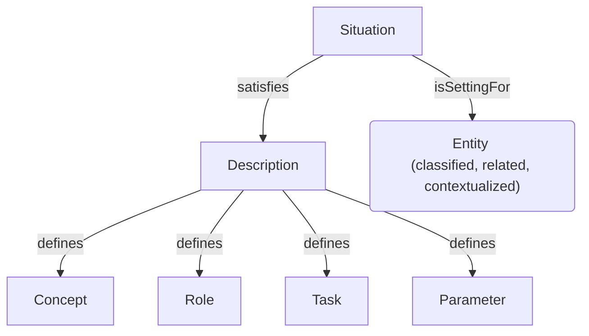
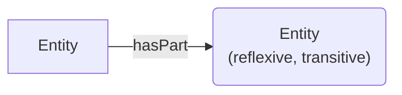
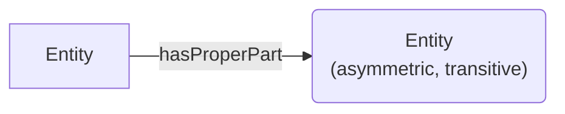
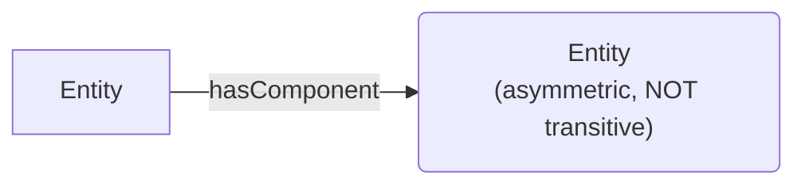
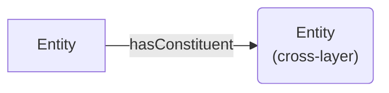
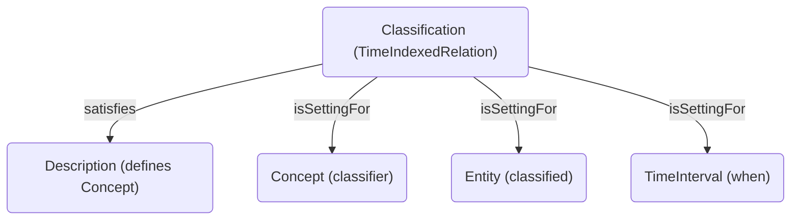
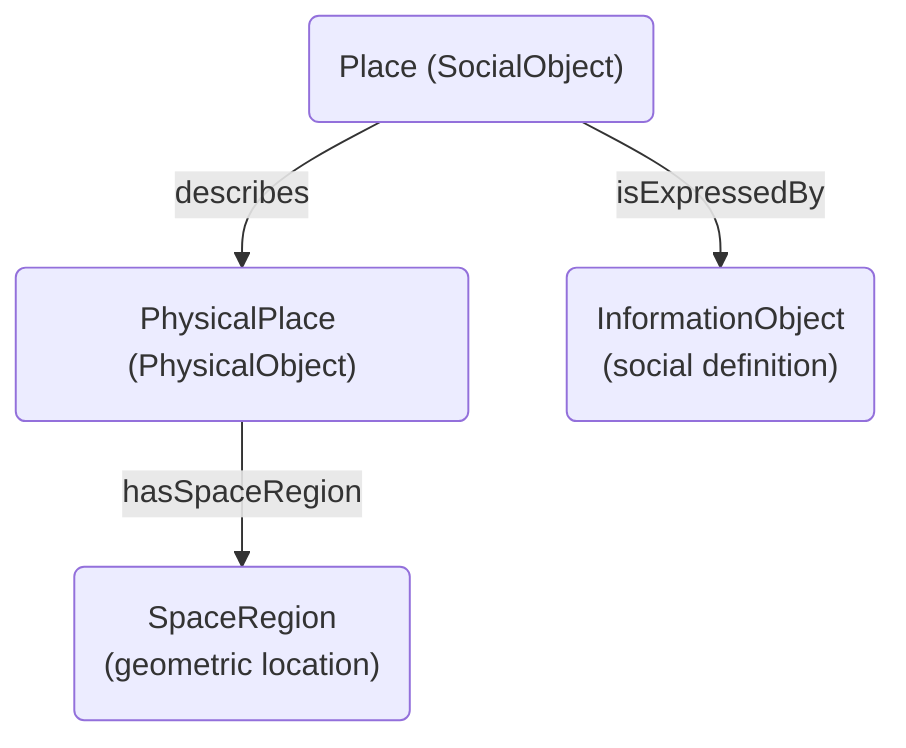
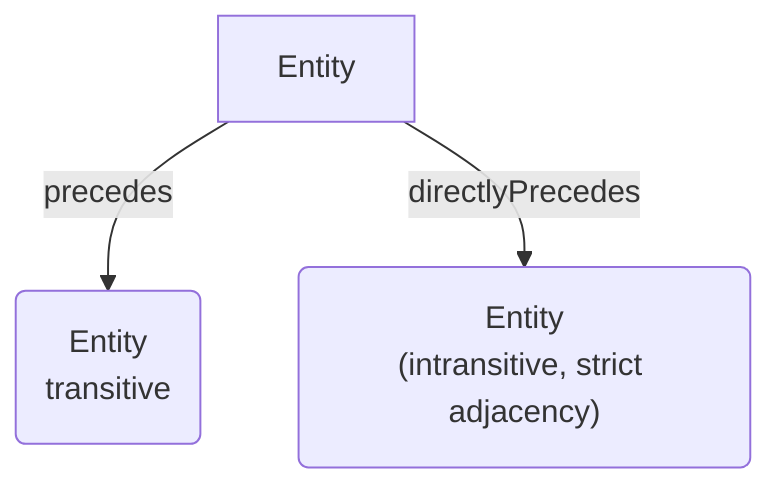

# Key Design Patterns

## Overview of DUL Patterns

DUL is not just a taxonomy but a **library of reusable patterns**. Each pattern solves a recurring modeling problem.

**Major Patterns:**
1. Descriptions & Situations (D&S)
2. Quality-Region
3. Participation
4. Information Realization
5. Mereological Patterns
6. Classification
7. Place
8. Sequence

## The Descriptions & Situations (D&S) Pattern

**Problem**: How to model context-dependent relations and time-varying properties?

**Solution**: Separate **intensional** (conceptual) and **extensional** (actual) aspects:



**When to use:**
- Role assignment: Agent plays Role in Situation
- Task execution: Action executes Task in Situation
- Time-indexed relations: Relations hold within temporal Situations
- Multi-perspective modeling: Same entities, different Situations/Descriptions

**Example Pattern Instance:**
```
Recipe (Plan, a Description)
  --defines--> 'Ingredient' (Role)
  --defines--> 'Mixing' (Task)

CookingSession (PlanExecution, a Situation)
  --satisfies--> Recipe
  --includesAgent--> Chef₁ (plays 'Cook' Role)
  --includesAction--> Mixing₁ (executes 'Mixing' Task)
  --includesObject--> Flour₁ (plays 'Ingredient' Role)
```

## The Quality-Region Pattern

**Problem**: How to model attributes with:
- Multiple measurement systems
- Temporal change
- Observational relativity

**Solution**: Reify attributes as Qualities, link to abstract Regions:


**When to use:**
- Scientific observation: Same phenomenon, different measurements
- Individual aspects matter: Not just "height" but "this building's height"
- Parameterized constraints: Concepts constrain regions through parameters

**Example Pattern Instance:**
```
DmitrisSkin (Quality)
  --isQualityOf--> Dmitri (Person)
  --hasRegion--> Yellow₁ (SocialObjectAttribute / Color value)

MeasurementSituation
  --includesObject--> Dmitri
  --includesQuality--> DmitrisSkin
  --satisfies--> ColorimetryDescription
    --defines--> RGBParameter
```

## The Participation Pattern

**Problem**: How to link events and objects?

**Solution**: Symmetric participation relation:


**Extensions:**
- **Agent participation**: Action --hasParticipant--> Agent (agent-specific)
- **Co-participation**: Object --coparticipatesWith--> Object (derived from shared event)

**When to use:**
- Event modeling: Who/what is involved?
- Provenance: What events affected this object?
- Social network analysis: Who co-participated in events?

**Example Pattern Instance:**
```
TennisMatch₁ (Event)
  --hasParticipant--> Vitas (Agent)
  --hasParticipant--> Jimmy (Agent)
  --hasParticipant--> TennisBall₁ (Object)

Vitas --coparticipatesWith--> Jimmy (inferred)
```

## The Information Realization Pattern

**Problem**: Distinguish abstract information from concrete manifestations.

**Solution**: Two-level information model:


**When to use:**
- Cultural heritage: Work vs. manifestations (FRBR-compatible)
- Legal documents: Legal content vs. physical copies
- Knowledge representation: Concepts vs. terms expressing them

**Example Pattern Instance:**
```
Constitution_ItalianRepublic (InformationObject)
  --expresses--> ItalianLegalSystem (Description/Norm)

PhysicalCopy₁ (InformationRealization / PhysicalObject)
  --realizes--> Constitution_ItalianRepublic

OralRecitation₁ (InformationRealization / Event)
  --realizes--> Constitution_ItalianRepublic
```

## Mereological Patterns

**Problem**: Model part-whole relations with different characteristics.

**Solution**: Multiple parthood properties:

**Pattern A: Reflexive Part-Whole**


Use when: General decomposition, entity is part of itself (mereologically valid)

**Pattern B: Proper Part-Whole**


Use when: Strict decomposition, part ≠ whole

**Pattern C: Component-System**


Use when: Designed artifacts with direct structural components

**Pattern D: Constitution**

Use when: Different ontological strata (social/physical, organism/molecular)

**Example Pattern Instance:**
```
Car₁ (DesignedArtifact)
  --hasComponent--> Engine₁ (direct component)
  --hasComponent--> Wheel₁ (direct component)

Engine₁
  --hasProperPart--> Piston₁ (engine part)

Car₁ --hasPart--> Piston₁ (inferred via transitivity of hasPart, if rules applied)

Person₁ (BiologicalObject)
  --hasConstituent--> Molecule₁ (cross-layer: organism → molecular)
```

## The Classification Pattern

**Problem**: Context and time-dependent classification.

**Solution**: Classification as a special Situation:



**When to use:**
- Role assignment: Agents play different roles at different times
- Taxonomic classification: Species membership, artifact categories
- Status tracking: Legal status, health status, employment status over time

**Example Pattern Instance:**
```
Classification₁
  --satisfies--> TrafficLaw (Norm defining vehicle types)
  --isSettingFor--> Vehicle₁ (Entity)
  --isSettingFor--> 'Truck' (Concept)
  --isSettingFor--> Interval₂₀₂₄ (when registered as truck)

Classification₂
  --satisfies--> HistoricalArchive (Description)
  --isSettingFor--> Vehicle₁ (same entity)
  --isSettingFor--> 'ClassicCar' (different Concept)
  --isSettingFor--> Interval₂₀₃₀ (after retirement from service)
```

## The Place Pattern

**Problem**: Locations are both physical and social constructs.

**Solution**: Distinguish PhysicalPlace and Place:


**When to use:**
- Physical location: Coordinates, geometric regions
- Social/administrative places: Countries, neighborhoods, institutions
- Hybrid: "Paris" is both a geographic region and a social construct

**Example Pattern Instance:**
```
Paris_Geographic (PhysicalPlace)
  --hasSpaceRegion--> Region48.8566N_2.3522E

Paris_City (Place, SocialObject)
  --isExpressedBy--> ParisCharter (InformationObject / legal document)
  --describes--> Paris_Geographic
  --isMemberOf--> FrenchCities (Collection)
```

## The Sequence Pattern

**Problem**: Model temporal or logical ordering.

**Solution**: Precedence relations:


**When to use:**
- Workflow: Task sequences
- Narrative: Event chronology
- Procedure: Step ordering

**Example Pattern Instance:**
```
Workflow₁ (Description)
  --defines--> Task₁, Task₂, Task₃

Task₁ --directlyPrecedes--> Task₂
Task₂ --directlyPrecedes--> Task₃

Task₁ --precedes--> Task₃ (inferred via transitivity)

WorkflowExecution₁ (Situation)
  --satisfies--> Workflow₁
  --includesAction--> Action₁ (executes Task₁)
  --includesAction--> Action₂ (executes Task₂)
  --includesAction--> Action₃ (executes Task₃)
```

## Pattern Selection Guide

| Modeling Need | Pattern | Key Classes | Key Properties |
|---------------|---------|-------------|----------------|
| Role assignment | D&S + Classification | Description, Role, Agent, Classification | defines, classifies, hasRole |
| Task execution | D&S + Participation | Plan, Task, Action, Agent | defines, executesTask, hasParticipant |
| Time-varying attributes | Quality-Region | Quality, Region, TimeInterval | hasQuality, hasRegion |
| Document modeling | Information Realization | InformationObject, InformationRealization | realizes, expresses |
| Part-whole decomposition | Mereological | Entity | hasPart, hasComponent, hasConstituent |
| Event participation | Participation | Event, Object, Agent | hasParticipant, coparticipatesWith |
| Workflow modeling | D&S + Sequence | Workflow, Task, Action, WorkflowExecution | defines, precedes, executesTask |
| Multi-perspective views | D&S | Description, Situation, Entity | satisfies, isSettingFor |
| Location modeling | Place | PhysicalPlace, Place, SpaceRegion | hasLocation, hasRegion |
| Organizational structure | SocialAgent + D&S | Organization, Role, Agent, Description | actsFor, hasRole, defines |

## Pattern Composition

Real-world modeling typically **combines multiple patterns**:

**Example: Project Management Ontology**

Uses:
1. **D&S**: Project (Plan) defines Roles/Tasks, ProjectExecution (Situation) satisfies Project
2. **Participation**: Actions have Agent participants
3. **Classification**: Agents classified by Roles (ProjectManager, Developer)
4. **Sequence**: Tasks ordered by precedence
5. **Quality-Region**: Project attributes (budget, timeline) as Qualities with Amount/TimeInterval Regions
6. **Mereological**: Project has sub-projects as proper parts

**Pattern Integration Strategy:**
1. Identify core entities (agents, resources, activities)
2. Apply D&S for role/task structure
3. Apply Participation for event-object links
4. Apply Classification for role assignment
5. Apply Sequence for workflow ordering
6. Apply Quality-Region for measurements/KPIs
7. Apply Mereology for hierarchical decomposition
