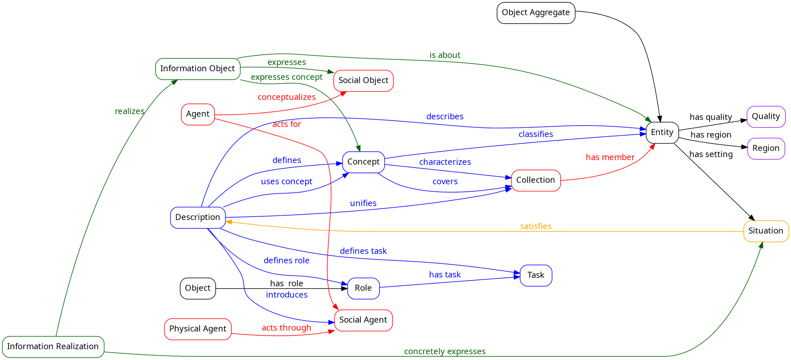

# References and Further Reading

## Primary Sources
- **DUL Namespace**: http://www.ontologydesignpatterns.org/ont/dul/DUL.owl
- **Ontology Design Patterns Portal**: http://ontologydesignpatterns.org/

## Foundational Papers
- Gangemi, A., & Mika, P. (2003). "Understanding the Semantic Web through Descriptions and Situations"
- Masolo, C., et al. (2003). "DOLCE: a Descriptive Ontology for Linguistic and Cognitive Engineering" (WonderWeb D18)
- Borgo, S., & Masolo, C. (2009). "Foundational Choices in DOLCE"

## Related Ontologies
- **DOLCE Lite-Plus**: Parent ontology
- **DOLCE Full**: Complete formalization
- **IOLite**: Information Objects ontology
- **COS/KCO**: Computational objects ontologies

## Philosophical Background
- Guarino, N. (1998). "Formal Ontology and Information Systems"
- Smith, B. (2003). "Ontology" (Blackwell Guide to the Philosophy of Computing and Information)
- Searle, J. (1995). "The Construction of Social Reality"

## Pattern Catalogs
- Gangemi, A. (2005). "Ontology Design Patterns for Semantic Web Content"
- Blomqvist, E., et al. (2016). "Ontology Design Patterns: Current Trends and Future Directions"

