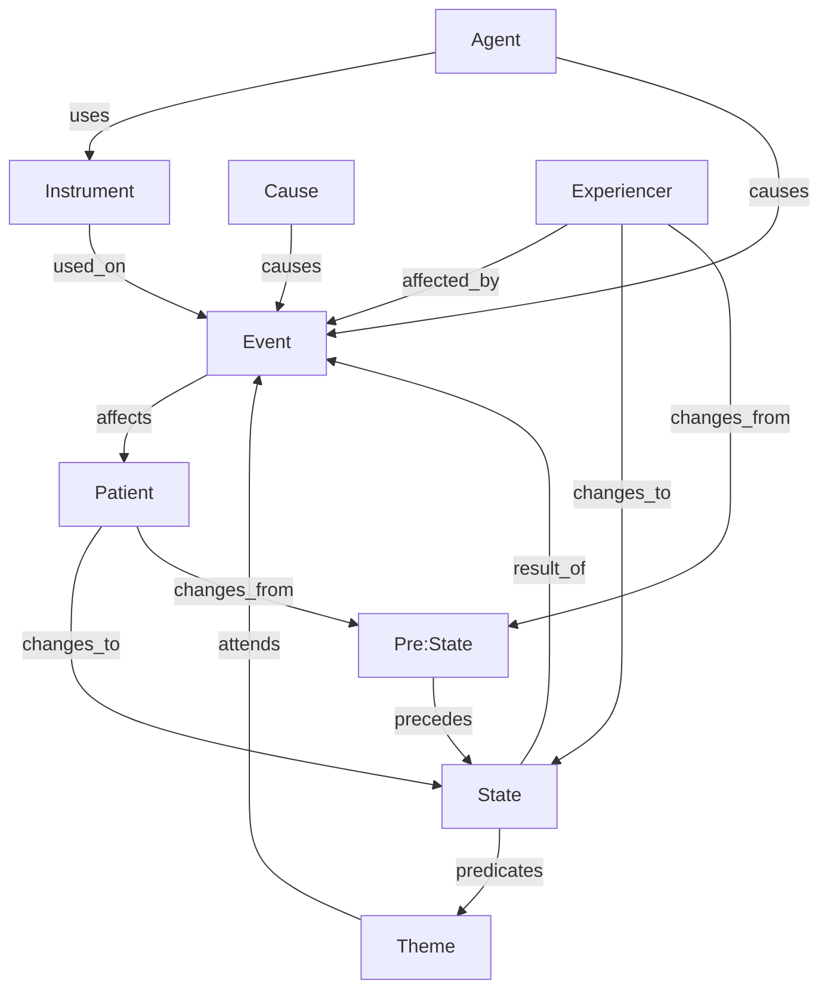
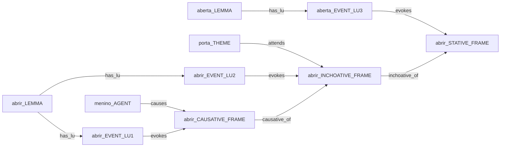

# Events

There is no consensus on the definition of *event* in the literature. In this project, *event* represents something that "occurs" over time, generally causing a change of state in some concept associated with the event. In general, events can be situated on the "timeline" and have a limited duration.
Linguistically, an event can be represented by verbs and verbal derivations. 

## Event Structure

Fig. 1 - A generic sketch of event structure

Figure 1 presents the general idea about events: an event indicates a change in some state associated with an entity or another event.

Although the concepts represented in Figure 1 can recall "generic thematic roles",  FrameNet name the roles based on the frame context. Thus, the following definitions should be considered only as a general overview of the concept.

## Concepts

### Agent
Some events can be characterized as the action of a sentient entity, acting intentionally to cause a result.

### Instrument
Instruments are entities used by agents in a given action.

### Cause
Characterizes the condition that causes an event (generally another event), without intentionality.

### Experiencer
Associated with events where there isn't strictly an action, but a stimuli whose effects can be perceived by an entity. 
Typically, an experiencer is associated with psychological events (emotion, perception, cognition).

### Patient
In events where there is some action, it characterizes the entity that is affected by the event, and there may or may not be a change in any of its states.

### Theme
This is the most generic concept in the structure, and it characterizes a "participant" in the event. In general, this participant is passive, and may or may not be affected by the event.

## Stative/Inchoative/Causative Structure

Some verbs can alternate between stative/inchoative/causative. For example:
- Stative: the door is open.

- Inchoative: the door opened.

- Causative: the boy opened the door.

Each use of the verb should be represented by different LU, which should be related to each other by lexical relations (causative_of/inchoative_of):

## Notes from DUL

More theoretically, events can be classified in different ways, possibly based on *aspect* (e.g. stative, continuous, accomplishement, achievement, etc.), 
on *agentivity* (e.g. intentional, natural, etc.), or on *typical participants* (e.g. human, physical, abstract, food, etc.). 
Here no special direction is taken, and the following explains why. 

Events are related to observable situations, and they can have different views at a same time. 
If a position has to be suggested here anyway, the participant-based classification of events seems the most stable and appropriate for many modelling problems. 

Consider a same event *rock erosion in the Sinni valley*:

**(1) Alternative aspectual views:** it can be conceptualized as an **accomplishment** (what has brought a certain state to occur), 
as an **achievement** (the state resulting from a previous accomplishment), 
as a **punctual** event (if we collapse the time interval of the erosion into a time point), 
or as a **transition** (something that has changed from a state to a different one). 
In the erosion case, we could therefore have good motivations to shift from one aspect to another:

* causation focus 
* effectual focus 
* historical condensation 
* transition (causality) 

The different views refer to the same event, but are still different: how to live with this seeming paradox? 
A typical solution e.g. in linguistics (cf. Levin's aspectual classes) and in DOLCE Full (cf. WonderWeb D18 axiomatization) is to classify events based on aspectual differences. 
But this solution would create different identities for a same event, where the difference is only based on the modeller's attitude. 

An alternative solution is suggested in DUL, and exploits the notion of (observable) *Situation*; a *Situation* is a view, consistent with a *Description*, 
which can be observed of a set of entities. 
It can also be seen as a *relational context* created by an observer on the basis of a **frame**.

Therefore, a *Situation* allows to create a context where each particular view can have a proper identity, while the *Event* preserves its own identity. 

For example, *ErosionAsAccomplishment* is a *Situation* where rock erosion is observed as a process leading to a certain achievement: 
the conditions (roles, parameters) that suggest such view are stated in a *Description*, which acts as a *theory of accomplishments*. 

Similarly, *ErosionAsTransition* is a *Situation* where rock erosion is observed as an event that has changed a state to another: 
the conditions for such interpretation are stated in a different *Description*, which acts as a *theory of state transitions*. 
Consider that in no case the actual event is changed or enriched in parts by the aspectual view. 

**(2) Alternative intentionality views:** Similarly to aspectual views, several intentionality views can be provided for a same Event. 
For example, one can investigate if an avalanche has been caused by immediate natural forces, or if there is any hint of an intentional effort 
to activate those natural forces. 

Also in this case, the *Event* as such has not different identities, while the causal analysis generates situations with different identities, 
according to what *Description* is taken for interpreting the *Event*. 

On the other hand, if the possible actions of an *Agent* causing the starting of an avalanche are taken as parts of the *Event*, 
then this makes its identity change, because we are adding a part to it. 

Therefore, if intentionality is a criterion to classify events or not, this depends on if an ontology designer wants to consider causality as a relevant 
dimension for events' identity. 

**(3) Alternative participant views:** A slightly different case is when we consider the basic participants to an *Event*. 
In this case, the identity of the *Event* is affected by the participating objects, because it depends on them. 

For example, if snow, mountain slopes, wind, waves, etc. are considered as an avalanche basic participants, 
or if we also want to add water, human agents, etc., that makes the identity of an avalanche change. 

Anyway, this approach to event classification is based on the designer's choices, and more accurately mirrors lexical or commonsense classifications 
(see. e.g. WordNet 'supersenses' for verb synsets). 

Ultimately, this discussion has no end, because realists will keep defending the idea that events in reality are not changed by the way we describe them, 
while constructivists will keep defending the idea that, whatever *true reality* is about, it can't be modelled without the theoretical burden of how we observe and describe it. 

Both positions are in principle valid, but, if taken too radically, they focus on issues that are only partly relevant to the aim of computational ontologies, 
which assist domain experts in representing a certain portion of reality according to their own assumptions and requirements. 
For this reason, in DUL both events and situations are allowed, together with descriptions, in order to encode the modelling needs, 
independently from the position (if any) chosen by the model designer.

