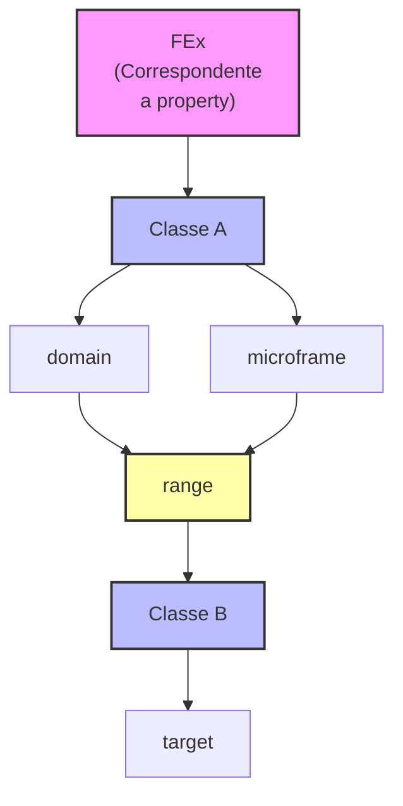

# Microframes

## What is a microframe?

A microframe is a specialized type of frame designed to represent relationships between entities as semantic frames.
The core idea is simple: treat relations themselves as frames, allowing for richer semantic modeling and greater specificity
in describing how entities interact.

## Structure

Microframes share the same structural foundation as traditional frames, but with a key constraint:

- They contain exactly **two Frame Elements (FEs)**: one representing the **Domain** of the relation and another representing the **Range**.

- Each FE must have a name that appropriately reflects the specific relation it represents, following the same naming principles as standard frames.

## Features

### Lexical Units

Like traditional frames, microframes can be evoked by **Lexical Units (LUs)**. This allows specific words or phrases to trigger
the relational concepts encoded in microframes, bridging lexical semantics with structural relations.

### Greater Specificity

Microframes enable the expression of **much more specific relations** than those typically captured by standard FrameNet frames.
While traditional frames model broad conceptual situations, microframes focus on precise relational nuances between entities.

### Multi-Frame Associations

A single microframe can be **associated with multiple frames**, allowing it to function as a reusable semantic component
across different conceptual domains.

## Use Cases

### Components of Complex Frames

Microframes can make explicit the relations between FrameElements of more complex frames through the use of frame-to-frame relations such as:

- **Subframe**: A microframe can be seen as a specific subframe of a larger, more complex frame, focusing in one aspect of the larger frame.
- **Perspective**: Different microframes can offer distinct perspectives on the situation expressed by a larger frame.

The relations Frame-Frame and FrameElement-FrameElement follow the same pattern already established in FrameNet.

### Qualia Relations

Microframes are used to express qualia relations between LUs, evolving the original idea of TQR (Ternary Qualia Relation).

### Generalization Across Events

Microframes allow for the **generalization of situations** that are common across a wide range of events.
They can specifically express aspects such as:

- **Time**: Temporal relations between entities or events.
- **Manner**: The way in which an action or relation occurs.
- **Means**: The method or instrument through which a relation is established.
- Other circumstantial or participant-oriented dimensions.

