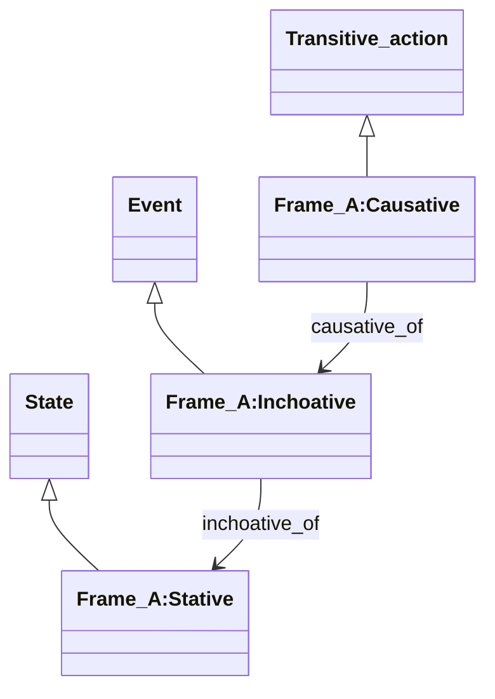
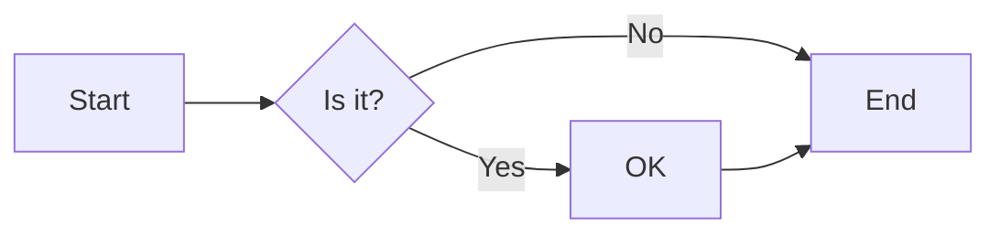
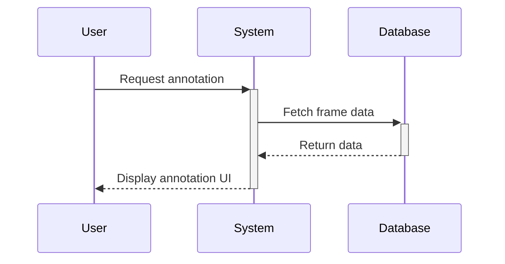

# Mermaid Diagram Test

This page demonstrates Mermaid diagram rendering in Webtool 4.2 documentation.

## Frame Causation Example

The following diagram shows the relationships between frame types:

## Additional Examples

### Simple Flowchart

### Sequence Diagram

This demonstrates that Mermaid diagrams from Obsidian can be directly copied into Webtool documentation files and will render correctly.
