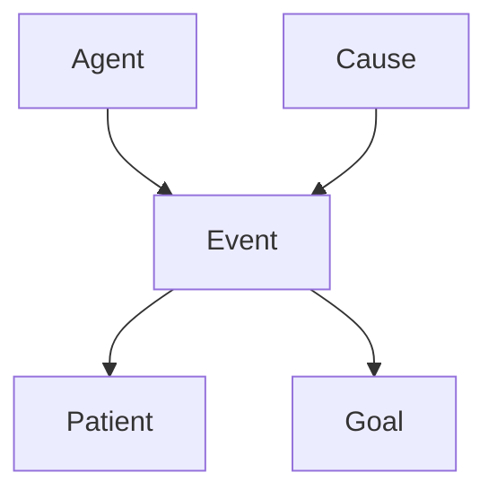

## Key Limitations of Mermaid

1. **Fixed Layout Algorithms**: Mermaid uses predefined layout strategies (top-down, left-right, etc.) that work well for structured diagrams but cannot produce the organic, force-directed layouts that Graphviz excels at.

2. **No Force-Directed Layouts**: The flowing, curved appearance in your Graphviz example (which likely uses `neato`, `fdp`, or `sfdp` engines) is not achievable in Mermaid.

3. **Limited Edge Routing**: Mermaid doesn't have the sophisticated edge routing algorithms that Graphviz uses to minimize crossings and create those smooth curved paths.

## Your Options

### Option 1: Stick with Mermaid (Limited)
For the FrameNet-style diagram (Image 1), Mermaid's flowchart could work:



But this won't give you the complex layout of Image 2.

### Option 2: Switch to Graphviz
For complex graphs like Image 2, you'll need Graphviz. You can:

- **Server-side rendering**: Use `viz.js` (JavaScript port of Graphviz) or call Graphviz binaries
- **Client-side rendering**: Use `@hpcc-js/wasm` (Graphviz compiled to WebAssembly)

Example with viz.js:
```javascript
import Viz from 'viz.js';
import { Module, render } from 'viz.js/full.render.js';

const viz = new Viz({ Module, render });

viz.renderString('digraph { a -> b }')
  .then(result => {
    // result is SVG string
  });
```

### Option 3: Hybrid Approach
- Use **Mermaid** for simple, structured diagrams
- Use **Graphviz** for complex network visualizations
- Detect which tool to use based on a prefix in your markdown

### Option 4: Alternative JavaScript Libraries
If you want to avoid Graphviz but need better layouts:

- **Cytoscape.js**: Powerful graph visualization with multiple layout algorithms
- **D3.js force layouts**: Complete control but requires more coding
- **vis.js network**: Good for network diagrams with physics simulation

## Recommendation

For reproducing Image 2 specifically, you **need Graphviz** or a library with force-directed layout capabilities. The most straightforward path would be:

1. Add `@hpcc-js/wasm` to your project for client-side Graphviz rendering
2. Keep Mermaid for simpler diagrams
3. Use a different code fence marker to distinguish them (e.g., ` ```graphviz` vs ` ```mermaid`)

